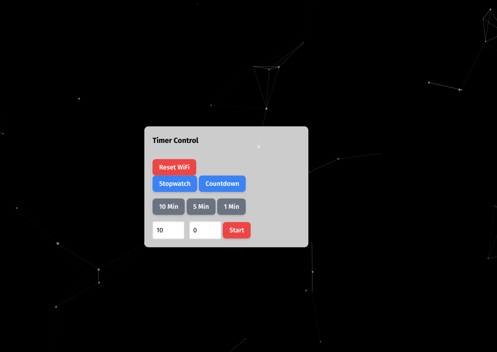
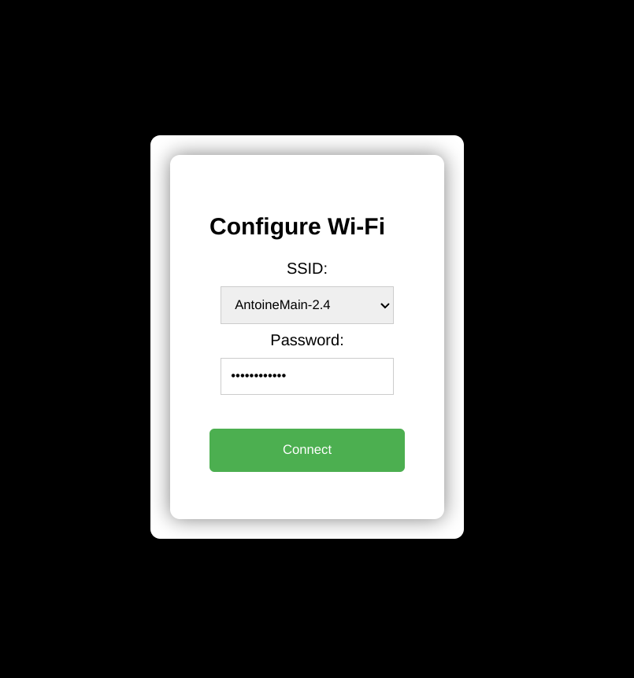

# Simple 7-Segment Display Control with ESP32 (FireBeetle v1.0)

This repository houses a project that simplifies controlling a 7-segment display using an ESP32 FireBeetle board. The key feature of this project is its web-based interface, allowing users to update the display content over a local network.

## Features

- Direct Control Over 7-Segment Display: Use the ESP32 FireBeetle board to control what is displayed, from digits to specific characters.
- Web Interface for Real-time Updates: A built-in web server on the ESP32 lets you change the display content through any browser on your local network.

- Comprehensive Documentation: Detailed setup and usage instructions ensure a smooth start, regardless of your experience level with hardware projects.


## Getting Started

### Prerequisites

Hardware: ESP32 FireBeetle board (v1.0), Adafruit 7-segment display (I2C backpack), breadboard, and jumper wires.
Software: Git, PlatformIO or Arduino IDE, and necessary ESP32 libraries.

### Hardware Setup

1. Connect the 7-segment display to the ESP32 according to the provided wiring diagram.
2. Ensure a stable power supply for the ESP32 board.

### Software Installation

1. Clone the repository to your local machine.

   ```bash
   git clone https://github.com/antoinebou12/ESP32-7SEG.git
   ```

2. Open the project with your preferred IDE or editor that supports PlatformIO or the Arduino IDE.
3. Install the necessary libraries mentioned in the `platformio.ini` file or the Arduino project.
4. Upload the code to your ESP32 FireBeetle board.

## Usage

After uploading the code to your ESP32 board:

1. Connect the ESP32 to a power source.
2. The ESP32 starts a web server accessible within your local network.
3. Find the ESP32's IP address from your serial monitor and visit the provided IP using a web browser.
4. Use the web interface to update the 7-segment display's content.

## Contributing

Contributions to improve the project are welcome. Please feel free to fork the repository and submit pull requests.

## License

This project is licensed under the MIT License - see the [LICENSE](LICENSE) file for details.